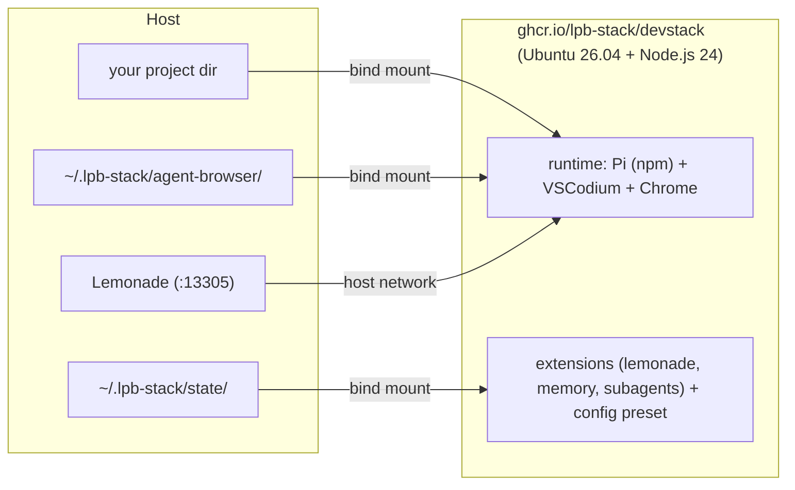
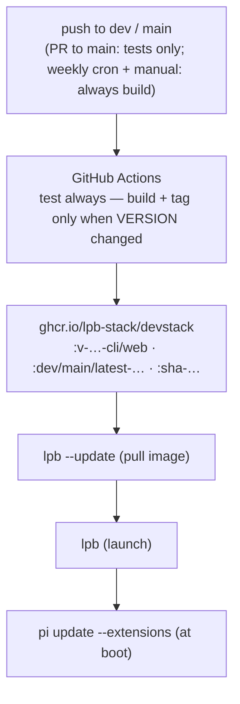

# LocalPibox Devstack

A local-first AI development environment in a single container: the
**Pi** coding agent, **VSCodium** editor, and **agent-browser** automation —
optimized for Qwen models served locally through **Lemonade**, targeting
AMD Strix Halo hardware. No cloud LLM required; your code and data stay
on your machine.

## Quick Start

### 1. Install the launcher (once)

Prerequisite: a Linux host with **Python 3** and **Podman** or **Docker**
(the launcher uses whichever container runtime it finds, podman first).

```bash
curl -fsSL https://raw.githubusercontent.com/lpb-stack/devstack/main/scripts/install.sh | bash
```

Installs `lpb` + `lpb.py` to `~/.local/bin` (no sudo needed — make sure
`~/.local/bin` is on your `PATH`) and the stack config files to
`~/.lpb-stack/devstack/`.

### 2. Run it

```bash
lpb /path/to/your/project      # default: Pi CLI session (foreground)
lpb --web /path/to/your/project  # VSCodium editor (background, prints a URL)
lpb --ssh /path/to/your/project  # sshd in the container for remote login
lpb                              # resumes your last project (or ~)
```

On the **first run** — in every mode (`lpb`, `--shell`, `--ssh`, `--web`) —
`lpb` checks the model-provider state (stored credentials + a live probe of
the Lemonade server). If it's missing or broken and you're on a terminal,
the **setup wizard** runs before the container starts: config repo, server
URL, API key, default model (from the server's live model list), MCP
servers, and lpb-memory config — every step validated, with errors shown and
re-asked
until they're right. The configuration is written straight into the state
volume, so it's persisted **before first use**; the launch summary ends with
a model status line.

- **Non-TTY** (hosts/CI) or `lpb --non-interactive`: no wizard — the env
  (`LPB_LEMONADE_BASE_URL` / `LPB_LEMONADE_API_KEY` / `lpb.conf.env`) is
  passed through and the container runs a non-interactive fallback.
- Re-run any time (all modes): `lpb setup` (wizard) and `lpb doctor`
  (read-only validation). Inside the container the same wizard is
  `lpb-config setup` (and `lpb-config check`).

### Common commands

```bash
lpb --stop       # stop the container
lpb --logs       # stream container logs
lpb --update     # update the launcher + pull the latest image
lpb setup        # initial setup wizard (server, key, model, memory)
lpb doctor       # validate the installation (read-only)
lpb --remove     # stop, remove container + state dirs
lpb --config     # show config file location + model status
lpb --help       # full usage
```

> `lpb stop`, `lpb logs`, `lpb update`, … also work (positional aliases).
> `lpb --tag dev|main|latest|<version>` selects the image pipeline
> (`--dev` / `--main` are shorthands). See [lpb CLI reference](doc/lpb-cli.md).

## What's Inside

| Component | Role |
|---|---|
| **Pi** | Coding agent CLI — mainstream pi from the npm registry (pinned in `lpb.stack.env`); Qwen thinking is handled by the lemonade plugin |
| **VSCodium** | Web-based editor (`:web` image), connects over the OpenVSCode protocol |
| **lemonade-pi-plugin** (forked) | Model provider for the local **Lemonade** server — Qwen thinking + vision support |
| **lpb-memory** | Persistent memory + session search for the agent |
| **pi-subagents** (forked) | Local-first subagent model registry (no hardcoded cloud models) |
| **agent-browser** + Chrome | Browser automation tools for the agent |
| **MCP servers** | Exa (web search), Context7 (library docs), agent-browser |
| **Lemonade** (host prerequisite) | Local model server — AMD/Strix Halo-optimized, serves GGUF models; on this host or any reachable host; model chosen by the user at setup (no default) |

## How It Works



### Where things live

| Host path | In container | Purpose |
|---|---|---|
| your project dir | `/home/lpb/workspace/<name>` | The code you work on |
| `~/.lpb-stack/state/` | `/home/lpb/.pi/` | Agent config, sessions, memory, extension clones — **persists across rebuilds** |
| `~/.lpb-stack/agent-browser/` | `/home/lpb/.agent-browser/` | Browser profiles & sessions |
| `~/.lpb-stack/devstack/` | (host only) | Launcher config: `config`, `last-version`, `token`, `last-project` |

### Images and tags

Two image flavours are published to `ghcr.io/lpb-stack/devstack`:

- **`…-cli`** — dev environment + Pi CLI (foreground)
- **`…-web`** — extends `-cli` with the VSCodium server

CI tags images per pipeline: `:0.0.x-lpb[-dev]-cli/web` (versioned),
`:dev-cli/web`, `:main-cli/web`, `:latest-cli/web`, `:weekly-cli/web`,
`:{sha}-cli/web`.

> ⚠️ There is **no bare `:cli`, `:web`, or `:latest` tag** — pulling one
> fails with `manifest unknown`. `lpb` always resolves a real tag for you,
> so in practice you never type image tags.

## Managing the Stack

| Command | What it does |
|---|---|
| `lpb /path` | Pi CLI session (foreground); no path → last project or `~` |
| `lpb --web /path` | VSCodium (background); `--port 8080` to change the port |
| `lpb --shell /path` | Interactive bash inside the container |
| `lpb --ssh [pubkey\|path] [project]` | sshd server in the container for remote login (key auto-detected from `~/.ssh` when omitted) |
| `lpb --ssh --ssh-password [pw]` | SSH password login (random if omitted, shown once; can combine with a key) |
| `lpb --stop` / `--remove` / `--logs` | Stop / stop+remove+state cleanup / stream logs |
| `lpb --update` | Self-update launcher + pull latest image for the selected pipeline |
| `lpb /path -- <pi-args>` | Pass args to Pi, e.g. `lpb /path -- -p "summarize this repo"` |

## Running Without the Launcher (advanced)

Manual `podman run` works too — note the **`-cli`/`-web` tag suffix**:

```bash
podman pull ghcr.io/lpb-stack/devstack:latest-web

podman run -d --name lpb-stack --network host --userns keep-id \
    -v /path/to/your/project:/home/lpb/workspace/myproject:Z \
    -v ~/.lpb-stack/state:/home/lpb/.pi:Z \
    -v ~/.lpb-stack/agent-browser:/home/lpb/.agent-browser:Z \
    ghcr.io/lpb-stack/devstack:latest-web

# URL + connection token are printed in the container logs:
podman logs -f lpb-stack
```

## Inside the Container

```bash
podman exec -it lpb-stack bash
```

| Command | Description |
|---|---|
| `pi` | Start the Pi CLI |
| `pi update --extensions` | Update unpinned packages (tag-pinned packages are skipped — move a pin with `pi install git:github.com/lpb-stack/<repo>@<new-tag>`) |
| `lpb-devstack validate` | Validate stack alignment (repos, branches, pins) |
| `lpb-devstack bump` | Bump VERSION + commit (the release trigger for CI build/tag) |
| `lpb-config setup` | Initial setup wizard (provider, model, memory) — the in-container twin of `lpb setup` |
| `lpb-config check` | Validate the installation (read-only) |
| `lpb-config memory setup` | Interactive wizard for the memory extension |

Inside the Pi TUI: `/login <provider>`, `/model`, `/settings` (thinking
level, theme), `/new` (new session).

## Update Flow



| Component | How it updates |
|---|---|
| Devstack image | CI builds on push to `dev`/`main`; `lpb --update` pulls it |
| `lpb` launcher | `lpb --update` self-update (branch follows the selected tag) |
| Extensions | Runtime — `pi update --extensions` (unpinned packages) |
| Config preset | `lpb-config update` (git pull of the config repo) |
| Pi core | Baked into the image from the npm registry (`LPB_PI_VERSION`) — a new version means a CI rebuild |

## Forked Repos & Upstream Policy

Pi itself is no longer a fork: the image installs mainstream pi from the
npm registry at `LPB_PI_VERSION` (the `lpb-stack/pi` fork is retired — see
[Fork improvements](doc/fork-improvements.md) for the retirement note).

The remaining fork URLs and branches are tracked in `lpb.stack.env` at the
repo root. Each fork keeps its LocalPibox work as clean commits on top of
upstream merges, so the delta vs upstream can always be extracted as one
patch.

| Repo | Upstream | LocalPibox work | Update policy |
|---|---|---|---|
| **lemonade-pi-plugin** | `lemonade-sdk/lemonade-pi-plugin` (no stable release) | Qwen thinking + vision support | follow upstream `main`, check periodically |
| **pi-subagents** | `tintinweb/pi-subagents` (v0.16.1) | centralized local-first subagent model registry | follow upstream; merge + repair as needed |
| **lpb-memory** | *(independent project)* | Pi memory extension (subprocess reviews) | no upstream to track |
| **config** / **devstack** | — | own | own |

Patches are **candidate upstream contributions** — they go upstream only if
generally useful and not too opinionated for this stack. See
[Fork improvements](doc/fork-improvements.md) for what each fork adds.

### Forking & repointing this stack

You can fork the stack and point it at your own repos instead of the
LocalPibox originals — the effort ranges from trivial (extensions, no
rebuild) to a full image rebuild (Pi core). Full procedure in
[Forking & Repointing](doc/forking.md).

## CI/CD

GitHub Actions (`.github/workflows/build-and-publish.yml`) runs on:

- push to `dev` or `main` (Dockerfile, `VERSION`, `support/`, `scripts/`,
  workflow changes)
- pull requests to `main` (tests only)
- weekly cron (Monday 03:00 UTC) and manual dispatch (always build)

Versioning is **manual**: `lpb-devstack bump` commits a new `VERSION`, and CI
builds + tags only when VERSION changed in the pushed commit. Pipeline jobs:
**VERSION check** → **test** (always) → **build & publish images** →
**tag repos** (CI tags the other 4 stack repos on their pipeline branches) →
**docs publish** (main pipeline only — publishes the stable docs version,
gated on the docs being flagged ready via `lpb-devstack release docs-ready`
before promotion) → **status**. Devstack itself is tracked by its `VERSION`
file and is never tagged.

## Troubleshooting

### `manifest unknown` when pulling an image

You used a bare tag (`:cli`, `:web`, `:latest`). Those don't exist — CI only
publishes versioned tags plus the `:dev-*`, `:main-*`, `:latest-*` floats.
Let `lpb` resolve the tag (`lpb --tag dev|main|<version>`), or pull e.g.
`ghcr.io/lpb-stack/devstack:latest-web` explicitly.

### No model available / setup failed

The Lemonade server on the host must be running before the setup wizard can
validate it: start it, then re-run `lpb setup` (or `lpb doctor` to see what
is wrong). Inside a running session, `/lemonade refresh` re-syncs the model
list once the provider is configured.

### Port already in use

```bash
lsof -i :3000                    # find what's using the port
lpb --web --port 8080 /project   # pick another port
```

### Editor token / URL

The VSCodium URL and connection token are auto-generated each start
(set `LPB_CONNECTION_TOKEN` in your project `.env` to persist one). They're
printed in the container logs: `lpb --logs`.

### Outdated extensions

```bash
podman exec -it lpb-stack pi update --extensions
```

### Need a newer image

```bash
lpb --update      # self-update launcher + pull the latest image for your pipeline
```

## Directory Structure

```
devstack/
├── Dockerfile            # image build (pi from npm, VSCodium, Chrome)
├── lpb.stack.env         # stack identity: config repo, pi version, images, container name
├── lpb.conf.env          # runtime defaults (baked into the image)
├── .env.example          # template for per-project .env (LPB_ vars)
├── scripts/              # CLIs + shared package (single source, baked to
│   │                     # /opt/pi-support/ by the Dockerfile)
│   ├── lpb               # bash wrapper
│   ├── lpb.py            # launcher engine (stdlib-only Python)
│   ├── lpb-config        # config repo manager (in-container)
│   ├── lpb-devstack      # DevOps tool (bump/tag/workspace/validate/release)
│   ├── install.sh        # host installer (lpb + stack tools)
│   └── localpibox/       # shared Python helpers (env/log/run/cli/stack)
├── support/              # runtime image tools (start.sh, browser, schemas…)
│   ├── start.sh          # container bootstrap (config, .env, extensions)
│   ├── entrypoint-*.sh   # cli / web entrypoints
│   └── docs/             # operational docs (e.g. subagent spawning)
└── doc/                  # reference docs (mirrored to the docs site)
```

## Documentation & Related Repos

- [Documentation site](https://lpb-stack.github.io/devstack/) — one version
  per stable release (served from the `docs` branch)
- [lpb-stack/pi](https://github.com/lpb-stack/pi) — retired pi fork (reference only; last state `pre-defork-0.0.71`)
- [lpb-stack/config](https://github.com/lpb-stack/config) — agent config preset
- [lpb-stack/lemonade-pi-plugin](https://github.com/lpb-stack/lemonade-pi-plugin) — Lemonade provider plugin
- [lpb-stack/pi-subagents](https://github.com/lpb-stack/pi-subagents) — subagent model registry
- [lpb-stack/lpb-memory](https://github.com/lpb-stack/lpb-memory) — persistent memory extension
